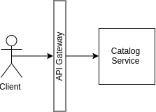
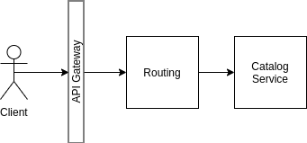

# Catalog Service

## Purpose of Catalog Service
Catalog has a single purpose of returning product information that was intended to be shown at the storefront, both product listing or PDP.
Basically saying Catalog will answer on questions:
* How the product should look like to satisfy storefront requirements.
* How client of the Catalog can request products.

## Usage examples

### Direct call
Catalog service can be involved directly through the gateway.


A good example of such services is sales channels integrations that have to synchronize across connected channels.

### Routing
Clients who want to retrieve product data by URL.


Literally any application.


### Listings and search

Category page, search results, layered navigation.


## Defining the request

See [Product Data Object](product-data-object.md)

* Different scenarios require different data of the same product.
* Catalog service is responsible for returning the most accurate product representation. 
* Catalog service does not perform searching but has to perform a basic data filtering.
* The purpose of filtering is reducing data before sending it to a client.
Example of such data reduction are 
    * On Listing Page, we need only attributes applicable for the listing.
    * On Product Details Page we need to return variations only for the selected options.


### JSON

```json
{
  "query": "products",
  "filters": [
    {
      "field":  "id",
      "values": [
        "1652b2fe-f758-11e9-8f0b-362b9e155667",
        "1652b588-f758-11e9-8f0b-362b9e155667",
        "1652b7c2-f758-11e9-8f0b-362b9e155667",
        "1652b8f8-f758-11e9-8f0b-362b9e155667",
        "1652bb00-f758-11e9-8f0b-362b9e155667",
        "1652bc40-f758-11e9-8f0b-362b9e155667",
        "1652be5c-f758-11e9-8f0b-362b9e155667",
        "1652bf88-f758-11e9-8f0b-362b9e155667",
        "1652c186-f758-11e9-8f0b-362b9e155667"
      ]
    }
  ],
  "fields": [
    {"field": "name"},
    {"field": "sku"},
    {
      "document": "priceRange",
      "fields": [
        {
          "document": "minimumPrice",
          "fields": [
            {"field": "finalPrice"}
          ]
        }
      ]
    },
    {
      "document": "attributes",
      "filters": [
        {
          "field": "attributeCode",
          "values": [
            "attributeCode1",
            "attributeCode2",
            "attributeCode3"
          ]
        }
      ],
      "fields": [
        {"field": "attributeCode"},
        {"field": "values"}
      ]
    },
    {
      "document": "options",
      "fields": [
        {"field":  "*"}
      ]
    }
  ]
}
```
### XML

```xml
<query name="products">
    <filters>
        <field name="id">
            <value>1652b2fe-f758-11e9-8f0b-362b9e155667</value>
            <value>1652b588-f758-11e9-8f0b-362b9e155667</value>
            <value>1652b7c2-f758-11e9-8f0b-362b9e155667</value>
            <value>1652b8f8-f758-11e9-8f0b-362b9e155667</value>
            <value>1652bb00-f758-11e9-8f0b-362b9e155667</value>
            <value>1652bc40-f758-11e9-8f0b-362b9e155667</value>
            <value>1652be5c-f758-11e9-8f0b-362b9e155667</value>
            <value>1652bf88-f758-11e9-8f0b-362b9e155667</value>
            <value>1652c186-f758-11e9-8f0b-362b9e155667</value>
            </value>
        </field>
    </filters>
    <fields>
    
    </fields>
    <field name="name" />
    <field name="sku" />
    <document name="priceRange" >
        <document name="minimumPrice">
            <field name="finalPrice" />
        </document>
    </document>
    <document name="attributes">
        <filter name="attributeCode">
            <filter>attributeCode1</filter>
            <filter>attributeCode2</filter>
            <filter>attributeCode2</filter>
        </filter>
    </document>
</query>
```
### GraphQL

```graphql
{
  products(id: {in: [
    "1652b2fe-f758-11e9-8f0b-362b9e155667",
    "1652b588-f758-11e9-8f0b-362b9e155667",
    "1652b7c2-f758-11e9-8f0b-362b9e155667",
    "1652b8f8-f758-11e9-8f0b-362b9e155667",
    "1652bb00-f758-11e9-8f0b-362b9e155667",
    "1652bc40-f758-11e9-8f0b-362b9e155667",
    "1652be5c-f758-11e9-8f0b-362b9e155667",
    "1652bf88-f758-11e9-8f0b-362b9e155667",
    "1652c186-f758-11e9-8f0b-362b9e155667"
  ]}) {
    fields {
      name
      sku
      priceRange {
        minimumPrice {
          finalPrice
        }
      }
    }
  }
}
```

# Query and scope

Catalog service should support execution scope.
The primary purpose of the scope is defining the data context.
This context may lead to data transformation before returning data to a client.
A good example of the scope usage is values localization.

```json
{
  "query": "products",
  "filters": [
    {"field":  "id", "values": ["1652b2fe-f758-11e9-8f0b-362b9e155667"]}
  ],
  "fields": [
    {"field": "name"},
    {"field": "sku"}
  ],
  "scope" : [
    {"argument":  "currency", "value":  "USD"},
    {"argument":  "locale", "value":  "en_US"},
    {"argument":  "store", "value":  "default"},
    {"argument":  "group", "value":  "NOT_LOGGED_IN"},
    {"argument":  "version", "value":  "1572297883"}
  ]
}
```

Examples of scopes:

* `currency`: currency for price values.
* `locale`: instruction for applying language translation.
* `store`: target store. 
* `group`: customer group identifier.

Scope has to be defined for each call.
Defaults can be retrieved from the catalog service.
