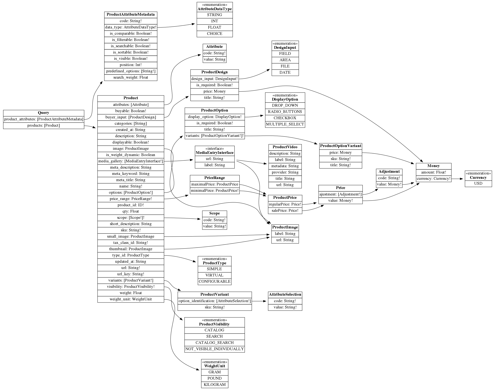

# Schema 



# Product options

The main difference between product templates (types)
that we have at the moment can be expressed through the 
options they provide.
With the current situation, we have as many product
options types as product types some of the options can be 
combined, which multiplies product template variations 
for a storefront.

So, current product schema looks like *
```json
  {
    "sku" : "some-product-sku",
    "customizableOptions": [{}, {}],
    "downloadableOptions": [{}, {}],
    "configurableOptions": [{}, {}],
    "bundleOptions": [{}, {}],
    "giftAmountOptions": [{}, {}] 
  }
```

The purpose of this document is to explain how to avoid option types multiplication for product storefront representation.

Let's figure out options common part for all product types.
To display a list of options at the storefront is enough to know about:
option title, label, something that uniquely represent the option variants for storefront user.
Each option variant should know about possible price change that affects product price if the option selected.
As an optional benefit, it is good to have an SKU of each variant. If the variant has SKU we can recover additional info for this option like inventory record.
An option has to expose the display settings to tell storefront how it should be rendered.
```json
{
  "averageOptions":
  [
    {
      "title": "Fabric",
      "is_required": true,
      "variants" : [
        {
          "title": "cotton",
          "sku": "cotton-item",
          "price": {
            "value": {
              "amount": 10.00,
              "currency": "USD"
            },
            "adjustment" : {
              "value" : {
                "amount": 0.80,
                "currency": "USD" 
              }
            }
          }
        },
        {
          "title": "polyester",
          "sku": "polyester-item",
          "price": {
            "value": {
              "amount": 10.00,
              "currency": "USD"
            },
            "adjustment" : {
              "value" : {
                "amount": 0.80,
                "currency": "USD" 
              }
            }
          }
        }
      ]
    }
  ]
}

```

Let's describe these structures with GrapQL syntax for better visibility.
```graphql
enum DisplayOption{
	DROP_DOWN
	RADIO_BUTTONS
	CHECKBOX
	MULTIPLE_SELECT
}

interface ProductOptionVariant{
	title : String!
	sku : String
	price : Money
}

interface ProductOption{
	title : String!
	is_required : Boolean!
	display_option : DisplayOption!
	variants : [ProductOptionVariant!]!
}
```

This bare minimum that we need to display options at product page.
the beauty of this option is the extensibility perspective.
For instance, if we want to express a downloadable option through this schema, we have to extend it 
with a single additional attribute - sample link.

```
interface DownloadableOptionVariant implements ProductOptionVariant{
	title : String!
	sku : String
	price : Money
	sample_link : String
}
```
In case we need to render options for bundle product it is enough to filter options by stock availability.
Because this is storefront representation, our schema should not rely on the way how the option price is defined.
It is enough to return 


---------------------------------------------------------


# Product prices

## Price range instead of prices.

Listing page has to show price range for products.
minimal list price 
minimal sales price
maximal list price 
maximal sales price 

``` graphql

type Query{
	products : [Product]
	product_attributes : [ProductAttributeMetadata]
}

type Product{
	product_id : ID!
	scope : [Scope!]!
	sku : String!
	url_key : String!
	url : String!
	name : String!
	meta_description : String
	meta_keyword : String
	meta_title : String
	description : String
	short_description : String
	visibility : ProductVisibility!
	displayable : Boolean!
	buyable : Boolean!
	tax_class_id : String!
	weight : Float
	weight_unit : WeightUnit
	is_weight_dynamic : Boolean
	created_at : String
	updated_at : String
	type_id : ProductType
	qty : Float
	image : ProductImage
	small_image : ProductImage
	thumbnail : ProductImage
	media_gallery : [MediaEntryInterface!]
	attributes : [Attribute]
	price_range : PriceRange!
	variants : [ProductVariant!]
	options : [ProductOption!]
	buyer_input : [ProductDesign]
	categories : [String]
}

type Scope{
	code : String!
	value : String!
}

enum ProductVisibility{
	CATALOG
	SEARCH
	CATALOG_SEARCH
	NOT_VISIBLE_INDIVIDUALLY
}

enum WeightUnit{
	KILOGRAM
	GRAM
	POUND
}

enum ProductType{
	SIMPLE
	VIRTUAL
	CONFIGURABLE
}

type ProductImage implements MediaEntryInterface{
	url : String
	label : String
}

interface MediaEntryInterface{
	url : String
	label : String
}

type Attribute{
	code : String!
	value : String
}

type PriceRange{
	minimalPirce : ProductPrice!
	maximalPrice : ProductPrice
}

type ProductPrice{
	regularPrice : Price!
	salePrice : Price!
}

type Price{
	value : Money!
	ajustment : [Adjustment!]
}

type Money{
	amount : Float!
	currency : Currency!
}

enum Currency{
	USD
}

type Adjustment{
	value : Money!
	code : String!
}

type ProductVariant{
	option_identification : [AttributeSelection!]
	sku : String!
	price_range : PriceRange!
}

type AttributeSelection{
	code : String!
	value : String!
}

type ProductOption{
	title : String!
	is_required : Boolean!
	display_option : DisplayOption!
	variants : [ProductOptionVariant!]!
}

enum DisplayOption{
	DROP_DOWN
	RADIO_BUTTONS
	CHECKBOX
	MULTIPLE_SELECT
}

type ProductOptionVariant{
	title : String!
	sku : String!
	price : Money
}

type ProductDesign{
	title : String!
	is_required : Boolean!
	design_input : DesignInput!
	price : Money
}

enum DesignInput{
	FIELD
	AREA
	FILE
	DATE
}

type ProductAttributeMetadata{
	code : String!
	data_type : AttributeDataType!
	is_sortable : Boolean!
	is_visible : Boolean!
	is_searchable : Boolean!
	is_filterable : Boolean!
	is_comparable : Boolean!
	position : Int!
	search_weight : Float
	predefined_options : [String!]
}

enum AttributeDataType{
	STRING
	INT
	FLOAT
	CHOICE
}

enum ScopeCode{
	WEBSITE
	STORE
	CUSTOMER_GROUP
}

type ProductVideo implements MediaEntryInterface{
	url : String
	label : String
	title : String
	description : String
	provider : String
	metadata : String
}
schema{
	query: Query
}

```
