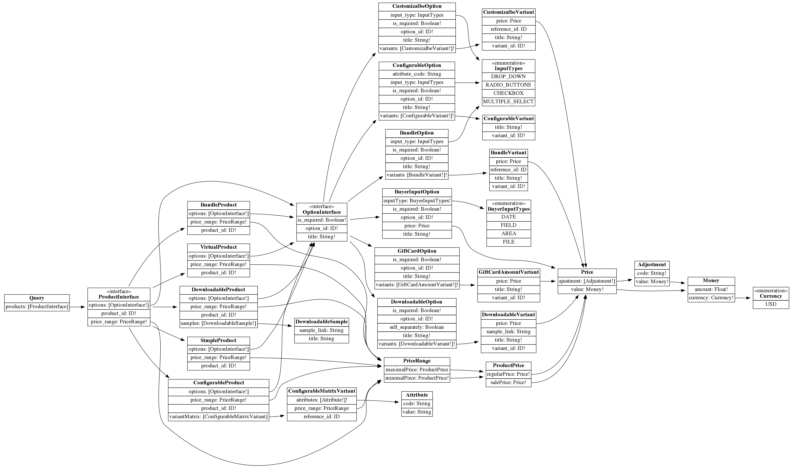

# Product options

The main difference between product templates (types)
that we have at the moment can be expressed through the 
options they provide.
With the current situation, we have as many product
options types as product types some of the options can be 
combined, which multiplies product template variations 
for a storefront.

As a result, current product schema looks like *
```json
  {
    "sku" : "some-product-sku",
    "customizableOptions": [{}, {}],
    "downloadableOptions": [{}, {}],
    "configurableOptions": [{}, {}],
    "bundleOptions": [{}, {}],
    "giftAmountOptions": [{}, {}] 
  }
```

The purpose of this document is to explain how to avoid option types multiplication for product storefront representation.


### Common options

Let's figure out options common part for all product types.
To display a list of options at the storefront is enough to know about:
* Option title.
* Set of variants that will be accessible at the storefront.
* Is this option mandatory.

Options and variants should to provide IDs to make it possible recognize them.

```graphql
interface VariantInterface {
    variant_id: ID
	title : String!
}

interface OptionInterface {
    option_id: ID
	title : String!
	is_required : Boolean!
}

interface VariantOptionInterface {
	variants : [VariantInterface!]!
}
```
This bare minimum that we need to display options at product page. 
In the same time, this is enough to build the simplest custom options which have business value.
Let's take it as the starting point.

### Option IDs 
Options and variants should to provide IDs. 
These IDs will be used to
* identify options on a page.
* perform lookups 
* interact with other business processes like adding a product to cart.

Currently, Magento does not expose good natural identifiers for options and values.
So we need to introduce them.
As a desired state we want to use UUID.
We can not use database IDs:
* we do not want to use database IDs explicitly at the storefront (need to add this statement to technical guidelines).
* we can not do this because different options stored in different tables.
To respect the actual implementation will can use base64encode of attributes which represent options/values in unique way.
 

### Options with price
Some of the options may require to specify a price adjustment for the original product price.
Because this is storefront representation, our schema may not rely on the way how the option price is defined.
It is enough to return the calculated values.
We do not care how the price was defined, as a constant adjustment or as a percent from the original price.
Actually, this is good from the unification perspective.
As a result, all price values are going to have a unified representation across the storefront.

```graphql
type Price {
    value : Money
    ajustments: [Adjustment!] 
}

interface PriceVariantInterface {
    variant_id: ID
 	price : Price
}
```

### Product as an Option
Some of the options represent a product or a product abstraction.
For such purposes, the option can be equipped with SKU as an extension.

```graphql
interface ProductVariantInterface {
    variant_id: ID
 	sku : String
}
```

### Example: GiftCard Product

Gift card product allows selecting from various amounts that can be assigned to it.

```graphql
type GiftCardOption OptionInterface & VariantOptionInterface & VariantOptionInterface{
    option_id: ID!
	title : String!
	is_required : Boolean!
	variants : [GiftCartAmountVariant!]!
}

type GiftCartAmountVariant implements VariantInterface & PriceVariantInterface
{
    variant_id: ID!
	title : String!
	price: Price
}
```

### Option input types 
A merchant can specify an input type for options.
The input type explains how options will be displayed.
Also, the option input type says - is it possible to select several variants from one option.

```graphql
enum InputTypes {
	DROP_DOWN
	RADIO_BUTTONS
	CHECKBOX
	MULTIPLE_SELECT
}

interface InputTypeInterface {
	input_type : InputTypes
}
```

### Example: Simple product with Customizable Option.

Currently we have enough information to figure out declaration of a classic customizable option.
```graphql
type CustomizalbeOption OptionInterface & VariantOptionInterface & InputTypeInterface {
    option_id: ID!
	title : String!
	is_required : Boolean!
	input_type : InputTypes
	variants : [CustomizalbeVariant!]!
}

type CustomizalbeVariant implements VariantInterface & PriceVariantInterface & ProductVariantInterface
{
    variant_id: ID
	title : String!
	price: Price
	reference_id : ID
}
```

### Example: Bundle Product

Bundle product does not have any specific differences with the classic simple product that has custom options.

```graphql
type BundleOption OptionInterface & VariantOptionInterface & InputTypeInterface {
    option_id: ID!
	title : String!
	is_required : Boolean!
	input_type : InputTypes
	variants : [BundleVariant!]!
}

type BundleVariant implements VariantInterface & PriceVariantInterface & ProductVariantInterface
{
    variant_id: ID!
	title : String!
	price: Price
	reference_id : ID
}
```

### Example: Downloadable Product

```graphql
type DownloadableOption OptionInterface & VariantOptionInterface {
    option_id: ID!
	title : String!
	is_required : Boolean!
	variants : [DownloadableVariant!]!
	sell_separately: Boolean!
}

type DownloadableVariant implements VariantInterface & PriceVariantInterface
{
    variant_id: ID!
	title : String!
	price: Price
	sample_link: String
}
```

Samples are not options, so they separated and represented at a product level.

```graphql
type DownloadableSample
{
    title: String!
    sample_link: String!
}
```

### Example: Configurable Product

Configurable products uses EAV attributes to specify options.
As a result, Configurable attribute has to know about attribute which provides variants.

```graphql
type ConfigurableOption OptionInterface & VariantOptionInterface{
    option_id: ID!
	title : String!
	is_required : Boolean!
	input_type : InputTypes!
	variants : [BundleVariant!]!
	attribute_code : String
}

type ConfigurableVariant implements VariantInterface
{
    variant_id: ID!
	title : String!
}
```

The configurable product contains variation matrix which explains how options selection can be transformed into a simple product.

```graphql
type Attribute {
    code: String!
    value: String
}

type ConfigurablematrixVariant {
    attributes: [Attribute!]!
    reference_id : ID!
    price_range: PriceRange
}
```

### Buyer input options

Magento also supports another way to customise the purchased product.
A buyer can specify some custom text or image that will be placed on a product. 
Despite the fact, these inputs also reprea completely sent customisation variants, such options due to their origin have a different representation at the storefront.

```graphql
enum BuyerInputTypes {
	FIELD
	AREA
	FILE
	DATE
}

type  BuyerInputOption implements OptionInterface {
	title : String!
	is_required : Boolean!
	inputType : DesignInput!
	price : Price
}
```


## Final schema 


### Diagram



### GraphQL schema 
```graphql
type Query{
	products : [ProductInterface]
}

interface ProductInterface{
	product_id : ID!
	price_range : PriceRange!
	options : [OptionInterface!]
}

type PriceRange{
	minimalPirce : ProductPrice!
	maximalPrice : ProductPrice
}

type ProductPrice{
	regularPrice : Price!
	salePrice : Price!
}

type Price{
	value : Money!
	ajustment : [Adjustment!]
}

type Money{
	amount : Float!
	currency : Currency!
}

enum Currency{
	USD
}

type Adjustment{
	value : Money!
	code : String!
}

interface OptionInterface{
	option_id : ID!
	title : String!
	is_required : Boolean!
}

interface VariantOptionInterface{
	variants : [VariantInterface!]!
}

interface VariantInterface{
	variant_id : ID!
	title : String!
}

interface PriceVariantInterface{
	variant_id : ID!
	price : Price
}

interface ProductVariantInterface{
	variant_id : ID!
	reference_id : ID
}

type GiftCardAmountVariant implements VariantInterface & PriceVariantInterface{
	variant_id : ID!
	title : String!
	price : Price
}

type GiftCardOption implements OptionInterface & VariantOptionInterface{
	option_id : ID!
	title : String!
	is_required : Boolean!
	variants : [GiftCardAmountVariant!]!
}

enum InputTypes{
	DROP_DOWN
	RADIO_BUTTONS
	CHECKBOX
	MULTIPLE_SELECT
}

interface InputTypeInterface{
	option_id : ID!
	input_type : InputTypes
}

type CustomizalbeOption implements OptionInterface & VariantOptionInterface & InputTypeInterface{
	option_id : ID!
	title : String!
	is_required : Boolean!
	input_type : InputTypes
	variants : [CustomizalbeVariant!]!
}

type CustomizalbeVariant implements VariantInterface & PriceVariantInterface & ProductVariantInterface{
	variant_id : ID!
	title : String!
	price : Price
	reference_id : ID
}

type BundleOption implements OptionInterface & VariantOptionInterface & InputTypeInterface{
	option_id : ID!
	title : String!
	is_required : Boolean!
	input_type : InputTypes
	variants : [BundleVariant!]!
}

type BundleVariant implements VariantInterface & PriceVariantInterface & ProductVariantInterface{
	variant_id : ID!
	title : String!
	price : Price
	reference_id : ID
}

type DownloadableOption implements OptionInterface & VariantOptionInterface{
	option_id : ID!
	title : String!
	is_required : Boolean!
	variants : [DownloadableVariant!]!
	sell_separately : Boolean
}

type DownloadableVariant implements VariantInterface & PriceVariantInterface{
	variant_id : ID!
	title : String!
	price : Price
	sample_link : String
}

type ConfigurableOption implements OptionInterface & VariantOptionInterface{
	option_id : ID!
	title : String!
	is_required : Boolean!
	input_type : InputTypes
	variants : [ConfigurableVariant!]!
	attribute_code : String
}

type ConfigurableVariant implements VariantInterface{
	variant_id : ID!
	title : String!
}

type Attribute{
	code : String
	value : String
}

type ConfigurableMatrixVariant{
	attributes : [Attribute!]!
	reference_id : ID
	price_range : PriceRange
}

enum BuyerInputTypes{
	FIELD
	AREA
	FILE
	DATE
}

type BuyerInputOption implements OptionInterface{
	option_id : ID!
	title : String!
	is_required : Boolean!
	inputType : BuyerInputTypes!
	price : Price
}

type SimpleProduct implements ProductInterface{
	product_id : ID!
	price_range : PriceRange!
	options : [OptionInterface!]
}

type VirtualProduct implements ProductInterface{
	product_id : ID!
	price_range : PriceRange!
	options : [OptionInterface!]
}

type BundleProduct implements ProductInterface{
	product_id : ID!
	price_range : PriceRange!
	options : [OptionInterface!]
}

type ConfigurableProduct implements ProductInterface{
	product_id : ID!
	price_range : PriceRange!
	variantMatrix : [ConfigurableMatrixVariant]
	options : [OptionInterface!]
}

type DownloadableSample{
	title : String
	sample_link : String
}

type DownloadableProduct implements ProductInterface{
	product_id : ID!
	price_range : PriceRange!
	options : [OptionInterface!]
	samples : [DownloadableSample!]
}
schema{
	query: Query
}
```

### One query to rule them all

```graphql
query
{
  products {
    product_id
    price_range {
      maximalPrice {
        regularPrice {
          value {
            amount
            currency
          }
        }
        salePrice {
          value {
            amount
            currency
          }
        }
      }
      minimalPirce {
        regularPrice {
          value {
            amount
            currency
          }
        }
        salePrice {
          value {
            amount
            currency
          }
        }
      }
    }
    ... on DownloadableProduct {
      samples {
        sample_link
        title
      }
    }
    ... on ConfigurableProduct {
      variantMatrix {
        attributes {
          code
          value
        }
        reference_id
        price_range {
          minimalPirce {
            salePrice {
              value {
                amount
                currency
              }
            }
          }
        }
      }
    }
    options {
      option_id
      title
      is_required
      ... on InputTypeInterface {
        input_type
      }
			... on VariantOptionInterface {
              variants {
        variant_id
        title
        ... on PriceVariantInterface {
          price {
            value {
              amount
              currency
            }
          }
        }
        ... on ProductVariantInterface {
          reference_id
        }
        ... on DownloadableVariant {
          sample_link
        }
      }
      }
    }
  }
}

```

* [Playground](https://faker.graphqleditor.com/akaplya/product-options/graphql)
