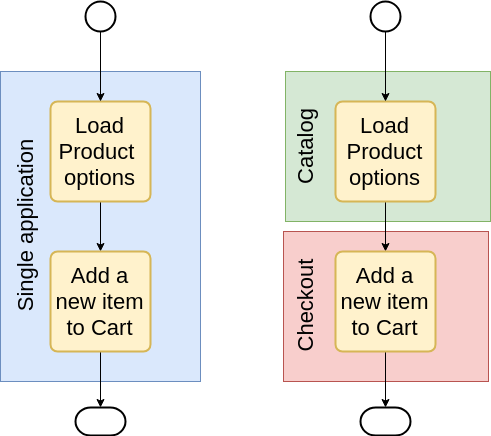

# Distributed services orchestration by using workflow (state machine)

This is an extension to [Service Isolation](service-isolation.md) document.

## Actual challenges
The keeping of strict boundaries between services rises a new challenge on how to organize complex cross-system communication that was inherited from the Magento application. The fact sub-applications can be deployed separately lead us to an obvious conclusion that such communication will be performed through the network and this communication does not have a state that can be shared between different components. The old scenario which required interaction across multiple domains, for instance, catalog and checkout, with this model of application deployment will have to invoke such operations remotely. The purpose of this document is to propose a way how to organize and manage such scenarios.

The main question, which must be addressed prior to many others is who will be responsible for organizing such communication? As soon one service is starting to call other services through the network it becomes responsible for handling responses, managing timeouts retries etc. That in its turn makes the service more complicated. Starting this time this service has a lot of knowledge about network communication and some specifications of called service. Also, because of knowledge about foreign service signature, the service becomes more fragile. Changes that were made at another end may lead to original service invalidation. Another drawback which should be considered, when one service encapsulates calls to another service such situation may affect the service replaceability. For instance, we have service `AddProductToCart` which incapsulate call to service `GetProductCustomizableOptions`. We can imagine a situation when a developer who knows about service `AddProductToCart` implementation details may build an extension with an assumption that `GetProductCustomizableOptions` will be always called inside of `AddProductToCart`. Replacing the service `AddProductToCart` by service `MyAddProductToCa` which is doing the same but does not call `GetProductCustomizableOptions` may unintentionally break logic of such extension. Possible "accidental" performance degradation also is a point of consideration. As soon we will make possible and convenience to call one service from another we can lose track cases when it happened. Network call must not be convenient enough to place it anywhere in the code (For instance in a plug-in of a frequently called method). Without proper testing degradation that can be introduced by code like this could be found after deploying on production. Also, debugging of the application that may invoke services that may invoke other services, and nesting level can be unlimited, is work for brave.

So, the decision that service must not invoke other services can make our lives easier in troubleshooting and helps to get more predictable behaviour from extensibility standpoint.

With this decision we will get:
* Isolation, a service can be responsible only for operation declared in its domain.
* Improved replaceability, confidence that service replacement will not break extensions that depend on this service implementation.
* Better monitoring and troubleshooting Due to the fact we have to keep our services more granular it is easier to find a cause of an issue in a small service (as well as performance drop). The fact that we do not need to debug our scenario through the multiple PHP session triggered by the nested calls is a huge plus from a development standpoint.

## Introduction of state machine

